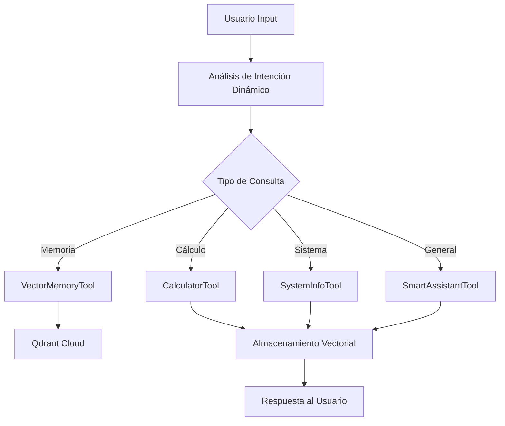

# 🧠 Asistente IA Dinámico

Un asistente de inteligencia artificial avanzado con memoria vectorial persistente, configuración completamente dinámica y sin datos hardcoded. Utiliza MCP (Model Context Protocol) con Qdrant Cloud para almacenamiento vectorial semántico.

## ✨ Características Principales

### 🔄 **Configuración Completamente Dinámica**
- ❌ **Sin datos hardcoded** - Toda la información se carga desde archivos de configuración
- 📊 **Contexto adaptativo** que evoluciona con cada interacción
- 🎯 **Patrones de intención configurables** desde JSON
- 🔧 **Capacidades modulares** habilitables/deshabilitables

### 🧠 **Memoria Vectorial Persistente**
- 🗃️ **Base de datos vectorial** con Qdrant Cloud
- 🔍 **Búsqueda semántica** inteligente
- 💾 **Almacenamiento automático** de conversaciones
- 📈 **Aprendizaje continuo** entre sesiones

### 🔌 **Integración MCP**
- 🤖 **Model Context Protocol** para Cursor IDE
- ☁️ **Qdrant Cloud** como backend vectorial
- 🔒 **Configuración segura** mediante variables de entorno
- 🚀 **Embeddings automáticos** con sentence-transformers

### 🛠️ **Herramientas Inteligentes**
- 🧮 **Calculadora avanzada** con funciones matemáticas
- 💻 **Información del sistema** en tiempo real
- 🧠 **Memoria vectorial** para consultas complejas
- 🤖 **Asistente general** sin limitaciones temáticas

## 🚀 Instalación

### Prerrequisitos

- Python 3.8 o superior
- Cuenta en [OpenAI](https://platform.openai.com/)
- Cuenta en [Qdrant Cloud](https://cloud.qdrant.io/)
- Cursor IDE (opcional, para MCP)

### 1. Clonar el Repositorio

```bash
git clone https://github.com/tu-usuario/AgenteBasico.git
cd AgenteBasico
```

### 2. Instalar Dependencias

```bash
pip install -r requirements.txt
```

### 3. Configurar Variables de Entorno

Crea un archivo `.env` en el directorio raíz:

```env
OPENAI_API_KEY=tu-api-key-de-openai
```

### 4. Configurar Qdrant Cloud

1. Crea una cuenta en [Qdrant Cloud](https://cloud.qdrant.io/)
2. Crea un cluster y obtén:
   - URL del cluster
   - API Key (JWT token)
3. Configura MCP en `~/.cursor/mcp.json`:

```json
{
  "mcpServers": {
    "qdrant": {
      "command": "C:\\Users\\tu-usuario\\.local\\bin\\mcp-server-qdrant.exe",
      "args": [],
      "env": {
        "QDRANT_URL": "https://tu-cluster.eu-central-1-0.aws.cloud.qdrant.io:6333",
        "QDRANT_API_KEY": "tu-jwt-token",
        "COLLECTION_NAME": "assistant_memory",
        "EMBEDDING_MODEL": "sentence-transformers/all-MiniLM-L6-v2"
      }
    }
  }
}
```

### 5. Instalar MCP Server (Opcional)

Para integración completa con Cursor:

```bash
pip install uv
uv tool install mcp-server-qdrant
```

## 📖 Uso

### Ejecutar el Asistente

```bash
python main.py
```

### Comandos Disponibles

| Comando | Descripción | Ejemplo |
|---------|-------------|---------|
| `Recordar [información]` | Almacena información en memoria vectorial | "Recordar que me gusta el café por las mañanas" |
| `Buscar [tema]` | Búsqueda semántica en memoria | "Buscar información sobre Python" |
| `Calcular [expresión]` | Cálculos matemáticos avanzados | "Calcular sqrt(144) + log(100)" |
| `Estado del sistema` | Información del hardware | "Estado del sistema" |
| Consulta general | Cualquier pregunta o tarea | "Explícame la teoría de la relatividad" |

### Ejemplos de Uso

```bash
🟢 Tú: Recordar que trabajo en desarrollo de IA y me especializo en Python

🤖 Asistente: ✅ Información almacenada en base de datos vectorial (ID: a7b8c9d2)

🟢 Tú: Buscar mis especialidades profesionales  

🤖 Asistente: 🧠 Resultados de búsqueda vectorial para: 'especialidades profesionales'
📝 Información relacionada encontrada:
• Desarrollo de IA
• Especialización en Python
• Trabajo en tecnología...

🟢 Tú: Calcular el área de un círculo con radio 5

🤖 Asistente: 🧮 RESULTADO: 78.53981633974483
📊 ✅ Información almacenada en base de datos vectorial (ID: c3d4e5f6)
```

## ⚙️ Configuración

### Archivo `config.json`

El asistente se configura completamente mediante `config.json`:

```json
{
  "assistant_config": {
    "name": "Asistente IA Dinámico",
    "version": "2.0.0",
    "description": "Asistente completamente dinámico con base de datos vectorial",
    "features": {
      "dynamic_context": true,
      "vector_memory": true,
      "mcp_integration": true,
      "real_time_learning": true
    }
  },
  "capabilities": [
    {
      "name": "memoria_vectorial",
      "description": "Almacenamiento y búsqueda semántica",
      "enabled": true
    }
  ],
  "intent_patterns": {
    "memory_operations": {
      "store": ["recordar", "guardar", "almacenar"],
      "search": ["buscar", "qué recuerdas", "información anterior"]
    }
  }
}
```

### Personalización

- **Capacidades**: Habilita/deshabilita funcionalidades en `capabilities`
- **Patrones de intención**: Modifica reconocimiento de comandos en `intent_patterns`
- **Plantillas de respuesta**: Personaliza mensajes en `response_templates`
- **Configuración de aprendizaje**: Ajusta comportamiento en `learning_settings`

## 🏗️ Arquitectura

```
AgenteBasico/
├── main.py                 # Punto de entrada principal
├── mcp_qdrant_wrapper.py  # Wrapper para MCP Qdrant
├── config.json            # Configuración dinámica
├── requirements.txt       # Dependencias Python
├── .env                   # Variables de entorno (no incluido)
└── README.md             # Este archivo
```

### Componentes Principales

1. **DynamicContextManager**: Gestiona contexto y configuración dinámica
2. **MCPQdrantWrapper**: Interface con base de datos vectorial
3. **Herramientas Dinámicas**: Calculadora, sistema, memoria vectorial
4. **Flujo de Trabajo**: Procesamiento con LangGraph

### Flujo de Datos



## 🔧 Desarrollo

### Estructura del Código

- **Sin datos hardcoded**: Todo se carga desde configuración
- **Herramientas modulares**: Fácil agregar/quitar funcionalidades  
- **Configuración dinámica**: Cambios sin reiniciar
- **Logging automático**: Todas las interacciones se almacenan

### Agregar Nueva Herramienta

1. Crear clase heredando de `BaseTool`
2. Implementar método `_run()`
3. Agregar a la lista de herramientas en `run_dynamic_assistant()`
4. Configurar patrones de intención en `config.json`

### Testing

```bash
# Probar conexión a Qdrant
python test_qdrant_connection.py

# Ejecutar asistente en modo debug
python main.py --debug
```

## 📦 Dependencias

| Paquete | Versión | Propósito |
|---------|---------|-----------|
| `langchain-openai` | ^0.1.0 | Integración con OpenAI GPT |
| `langgraph` | ^0.2.0 | Flujo de trabajo de agentes |
| `qdrant-client` | ^1.14.3 | Cliente para Qdrant Cloud |
| `sentence-transformers` | ^3.3.1 | Generación de embeddings |
| `python-dotenv` | ^1.0.1 | Gestión de variables de entorno |
| `psutil` | ^6.1.0 | Información del sistema |

## 🤝 Contribuir

1. Fork el proyecto
2. Crea una rama para tu feature (`git checkout -b feature/nueva-funcionalidad`)
3. Commit tus cambios (`git commit -am 'Añadir nueva funcionalidad'`)
4. Push a la rama (`git push origin feature/nueva-funcionalidad`)
5. Crea un Pull Request

## 📋 Roadmap

- [ ] 🌐 **Integración web** con FastAPI
- [ ] 📱 **Interface gráfica** con Streamlit
- [ ] 🔌 **Más conectores MCP** (PostgreSQL, MongoDB)
- [ ] 🧠 **Modelos de embedding** configurables
- [ ] 📊 **Dashboard de analytics** para memoria vectorial
- [ ] 🔒 **Autenticación y multiusuario**
- [ ] 🌍 **Despliegue en la nube** (Docker + K8s)

## 🐛 Problemas Conocidos

- **Windows**: Puede requerir ajustes en rutas de MCP
- **Memoria**: Uso intensivo con conversaciones largas
- **API Limits**: Respeta límites de OpenAI API

## 📄 Licencia

MIT License - ver [LICENSE](LICENSE) para detalles.

## 🙏 Agradecimientos

- [OpenAI](https://openai.com/) por GPT-3.5
- [Qdrant](https://qdrant.tech/) por la base de datos vectorial
- [LangChain](https://langchain.com/) por el framework de agentes
- [Cursor](https://cursor.sh/) por la integración MCP

## 📞 Soporte

¿Necesitas ayuda? 

- 📧 **Email**: tu-email@ejemplo.com
- 💬 **Issues**: [GitHub Issues](https://github.com/tu-usuario/AgenteBasico/issues)
- 📖 **Documentación**: [Wiki del proyecto](https://github.com/tu-usuario/AgenteBasico/wiki)

---

⭐ **¡Si te ha sido útil, dale una estrella al repositorio!** ⭐
